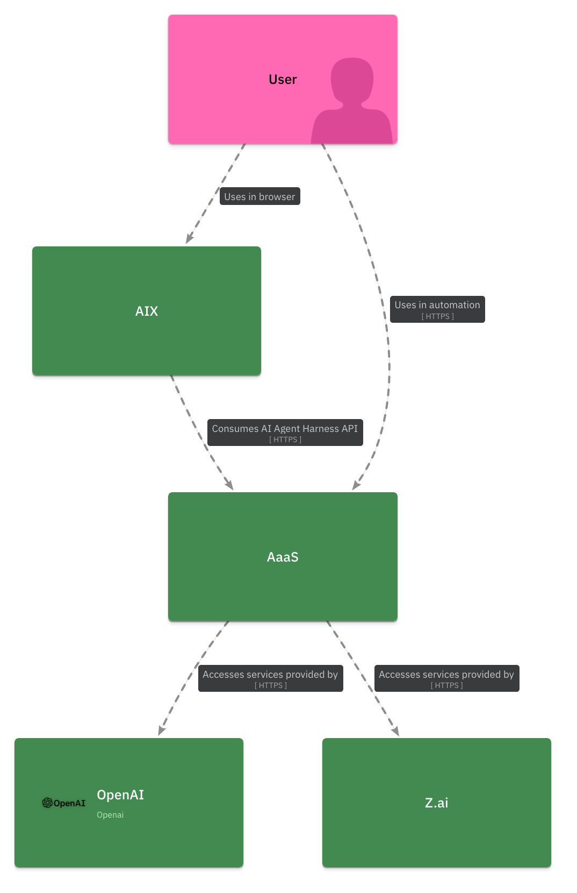
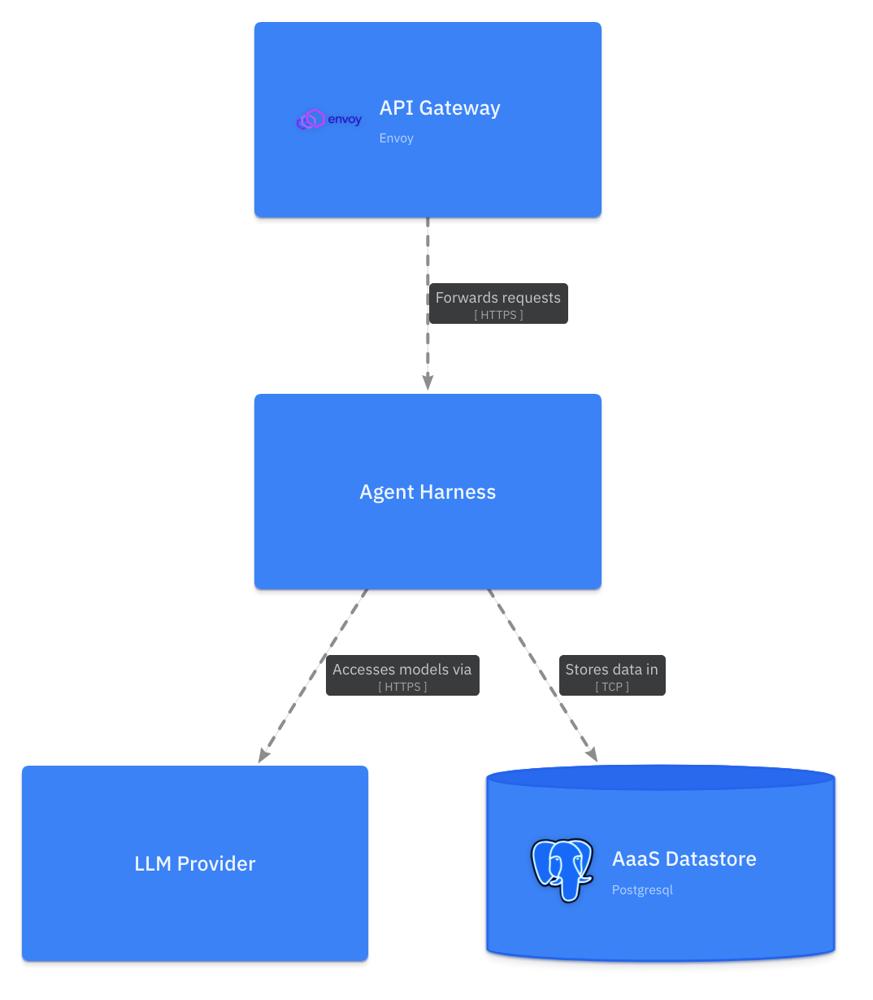
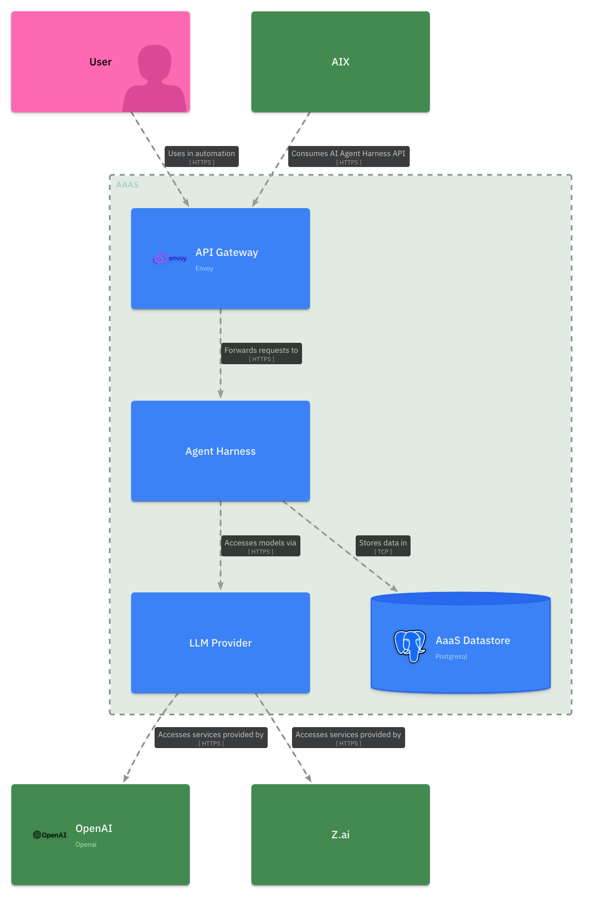
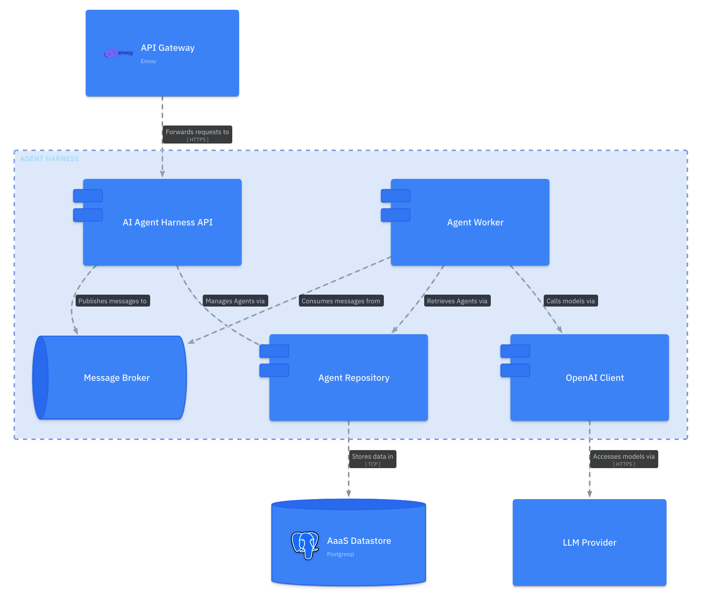
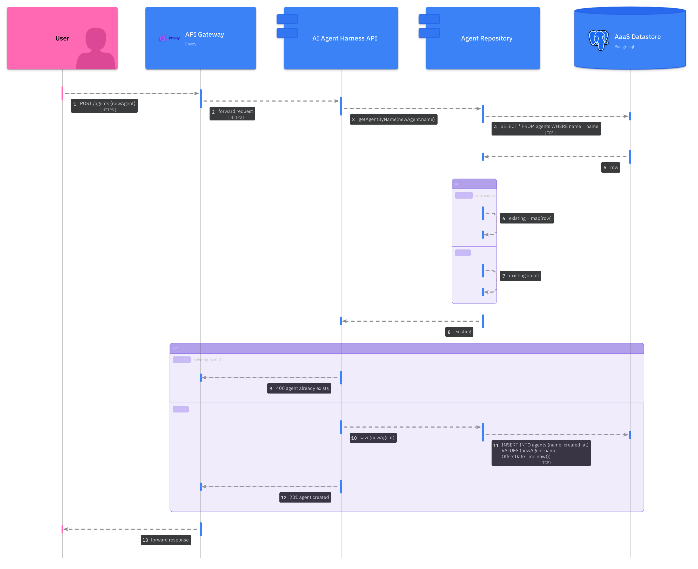

# Architecture Documentation Workshop

This workshop introduces a methodology for documenting software architectures by leveraging arc42 and the C4 Model.

Specifically, it covers:

- why we need a methodology for authoring documentation
- an introduction to the [arc42](https://arc42.org/) framework for documenting software architecture
- an introduction to the [C4 Model](https://c4model.com) approach to software architecture diagramming
- a model-based diagrams-as-code workflow for generating C4 Model diagrams with [LikeC4](https://likec4.dev/)

## Why do we need a methodology?

Quality documentation is a critical, and often under-prioritized, non-function requirement of any software system. Poor (or non-existent!) documentation adversely impacts a team's ability to effectively evolve a software system, engage external stakeholders, or onboard new members.

As developers embarking on documenting a software system, we're often tripped up because it's:

- not obvious *what* needs to be communicated in the documentation.
- nor is it clear *how* to best communicate *what* needs to be communicated.

This is entirely understandable - as developers, we tend to prioritize building deep expertise delivering working, performant software over communication skills. Even with the best intentions, it's easy to fall into *anti-patterns* that rely on internal mental models of what quality documentation 'is like' (rather sophisticated, tested, models that capture what quality actually 'is'), to produce the kind of 'developer prose' that results in unreadable, ineffective project wikis. Thankfully there are many resources out there that take the guess-work out of authoring quality documentation. This workshop aims to introduce you to two such resources - arc42 and the C4 Model.

> arc42 and the C4 Model assist us to systematically and repeatably apply principals of technical documentation, if you're interested in these underlying principals consider this [30 minute read](https://www.innoq.com/en/blog/2022/01/principles-of-technical-documentation/)

## The arc42 framework

The [arc42](https://arc42.org/) framework provides a lightweight approach to software architecture documentation, it outlines *what* is best to document and *how* we should do it; allowing us to focus on the task of documenting with confidence. Specifically, arc42 aims to produce documentation that answers questions such as:

- *why* does this system exist?
- *what* components collaborate to implement feature A?
- *how* is this system deployed?
- *when* transaction B fails what kind of compensation is executed?
- as an integrating system, *where* can I find a specification to consume this system's API?
- *when* did we decide to store system data in product C, *who* decided this, and are the forces that drove that decision still relevant?

You will notice that these questions could be quite difficult to answer by simply interrogating the system's source code or version control history - and it would be especially challenging to answer many of these for large complicated systems (which are often implemented across multiple code bases, each with their own version control history) without additional context. Typically, it's impossible for external stakeholders to find the answers they require without quality documentation that captures the wider context in which a system exists. Internal team members may have better luck, but will also struggle if the question is concerned with a part of the system unfamiliar to them. In the absence of quality documentation, the solution is often to 'find the person who knows'; however, this strategy exposes any serious project to significant risk: what if this 'person who knows' moves out of the team and is no longer available, or simply forgets the critical context required?

The arc42 template is comprised of 12 sections that have been developed to provide the maximum critical context to safeguard a project for the least amount of effort. Details regarding each section can be found on the arc42 website, but we will focus on just three in this subject:

- **Context and Scope**: this section documents the wider context in which the software system exists, it identifies the external users and systems that use or integrate with the system.
- **Building Block View**: this section documents the static decomposition of the system, it captures how code is organized into components and the dependencies between these component parts.
- **Runtime View**: this section captures the dynamic behavior of the running system, it details how important features work, how data flows through the system, and how exceptional behavior is handled.

## The C4 Model

Just as arc42 provides an approach for structuring our documentation, the [C4 Model](https://c4model.com) provides an approach for generating high-quality software architecture diagrams. The C4 Model was developed as an 'unofficial' evolution of UML, at a time where teams were abandoning heavy upfront design practices demanded by UML in favour of Agile and just-in-time design. Ultimately C4 tries to reinstate 'just enough' structure and syntax to realize some of the great communication benefits that a shared understanding of UML provided, while remaining light-weight enough to be compatible with Agile ways of working.

The C4 Model provides a set of hierarchical abstractions paired with hierarchical diagrams that capture the static decomposition of a software system from four levels of granularity.

| C4 Model abstraction | C4 Model diagram | description |
| ----------- | ------- | ----------- |
| Software System | System Context | Software systems represent the highest order and least granular scope for the C4 Model hierarchy. Software systems are defined as a grouping of C4 Model containers that work together to provide a service. At this scope we are primarily focussed on capturing the relationships between our subject system and external systems or users |
| Container | Container | Containers are typically standalone applications or services that can be 'deployed'. Candidates for modeling as C4 containers include a web UI running in a user's browser, the backend application serving such a web UI, a RDBMS server, or message broker - which together might form the components for a SaaS software system. |
| Component | Component | Components are logical groupings of code that implement the functionality of a container. The language in which a container is implemented has a significant impact over what might qualify as a component, in the object oriented paradigm a component is often an interface and implementing classes. |
| Code | Code | The most granular scope is the code itself. This scope is seldom included in architecture documentation because code is considered high entropy and keeping such documentation aligned with a changing code base is rarely worth the effort. However, for critical parts of a system a few code diagrams (typically UML class, sequence or ER diagrams) may be useful. |

## Model-based diagrams-as-code with LikeC4

Diagrams-as-code is an approach to generating software diagrams from code-like markup instead of manually crafting diagrams in a visual editor. The key benefits of a diagrams-as-code approach are:

- because the diagrams are code, they can be tracked in version control just like any other code source.
- styling and placement of diagram elements is handled by an engine, meaning that we don't have to worry about arranging elements in the first place or re-arranging them when we make updates.
- because the diagrams are code we can easily build tooling that emits or processes this code as part of an automated build pipeline.

If you've ever used tools like PlantUML or Mermaid you will be familiar with the concept of diagrams-as-code, and perhaps have experienced the benefits outlined previously first-hand. Tools like PlantUML and Mermaid are excellent for quickly generating small one-off diagrams, but they have some significant limitations when it comes to documenting an entire system's architecture, most notably they provide little support for generating multiple views of a software system in a consistent way. Tools like LikeC4 extend the diagrams-as-code approach by enabling us to model a software system once; and from this single source of truth, generate multiple views of the system.

Model-based approaches provide:

- a single source of truth from which diagrams can be generated in a consistent way.
- the ability to declare and generate multiple 'views' of a system as a series of diagrams, which is particularly helpful for managing the complexity of documenting large systems.
- greater tooling opportunities that emit or process the model to enforce constraints or enrich the model with meta data to improve meaning.

LikeC4 provides a syntax and tooling (via the LikeC4 CLI) to declare the C4 Model hierarchical abstractions in code and from this generate corresponding C4 Model diagrams.

## Modelling a system

The remainder of this workshop shows you how to leverage the C4 Model (and LikeC4) to document a hypothetical Agent as a Service software system:  

*The Agent as a Service (AaaS) system provides users the ability to configure AI agents to act on their behalf in a secure environment. Users consume AaaS services via two interfaces, the AI Experience (AIX) web UI (maintained by an external team), or directly via a RESTfull AI Agent Harness API exposed by the AaaS - AIX consumes AaaS via this same REST API. The AaaS is currently integrated with two LLM providers, OpenAI and Z.ai. The AaaS is deployed as four applications; an Envoy Proxy that acts as a gateway to the AaaS system, an Agent Harness application that exposes the AI Agent Harness API and implements all agent logic; an LLM Provider application that routes requests from the Agent Harness to LLM services provided by OpenAI and Z.ai; a PostgreSQL database in which all AaaS data is stored.*

### A C4 Model specification in LikeC4

To model a systems in LikeC4 we first need to declare a *specification*, which defines what *elements* are appropriate for the model.

The C4 Model hierarchy is comprised of software systems, containers, components and code, however we will not be documenting code so we'll leave this level of the hierarchy out of our specification. The following LikeC4 specification defines the C4 Model hierarchy, add it to a `aaas.c4` file:

```likec4
specification {
    element actor {
        notation 'Actor'
        style {
            shape person
        }
    }
    element software-system {
        notation 'Software System'
        style {
            color green
        }
    }
    element container {
        notation 'Container'
    }
    element component {
        notation 'Component'
        style {
            shape component
        }
    }
}
```

While actors are not a level of the C4 Model hierarchy, it's critical that we can capture system users. We'll add an actor element for this purpose:

```likec4
specification {
    element actor {
        notation 'Actor'
        style {
            shape person
        }
    }

    // other elements...
}
```

### Modelling software systems

Now we can begin modeling the software system level of the AaaS system. From the system description we know that the external consumers of the AaaS system are a single User actor and the AIX web UI, and the external systems on which AaaS depends are the LLM services provided by OpenAI and Z.ai. We can model these systems as so:

```likec4
specification {
    // elements...
}

model {
    user = actor 'User'
    oai = software-system 'OpenAI' {
        style {
            icon tech:openai
        }
    }
    zai = software-system 'Z.ai'
    aix = software-system 'AIX'
    aaas = software-system 'AaaS'

    aix -> aaas 'Consumes AI Agent Harness API' {
        technology 'HTTPS'
    }
    aaas -> oai 'Accesses services provided by'  {
        technology 'HTTPS'
    }
    aaas -> zai 'Accesses services provided by'  {
        technology 'HTTPS'
    }
    user -> aix 'Uses in browser'
    user -> aaas 'Uses in automation'  {
        technology 'HTTPS'
    }
}
```

### Generating a system context diagram

We now have both a specification and model, which is enough to begin generating diagrams.

> The LikeC4 tooling demonstrated in this workshop requires that you have NodeJS installed. If you don't have NodeJS, install the latest version from the [official NodeJS website](https://nodejs.org/en/download).

LikeC4 provides a number of ways to generate diagrams from `.c4` files, and the first we'll look at is the LikeC4 server, which can generate a live preview that gives us instantaneous feedback as we modify our model. In the same directory as your `aaas.c4` file, start the server with the `LikeC4` CLI:

```shell
npx likec4@1.59.1 start
```

On starting the server the LikeC4 UI should be launched in your default browser. Notice that there is a single diagram titled 'Landscape view', click on this diagram to view a C4 Model system context diagram generated from our AaaS model. To see the live preview in action, change the color of actors to hot pink by adding a custom color and modifying the actor element styling:

```likec4
specification {
    color hot-pink #ff69b4
    element actor {
        notation 'Actor'
        style {
            shape person
            color hot-pink
        }
    }

    // other elements...
}

model {
    // software systems and relationships...
}
```

The system context diagram should now look something like:



### Modelling containers

This is an excellent start, but we can generate far more views than just the C4 system context. Let's model out the containers that comprise the AaaS system and generate a C4 Model container diagram. Add the following containers to the `aaas` software system:

```likec4
specification {
    // elements...
}

model {
    // other software systems and relationships...

    aaas = software-system 'AaaS' {
        container gw 'API Gateway' {
            style {
                icon tech:envoy
            }
        }
        container ah 'Agent Harness'
        container lp 'LLM Provider'
        container ad 'AaaS Datastore' {
            style {
                shape storage
                icon tech:postgresql
            }
        }

        gw -> ah 'Forwards requests to' {
            technology 'HTTPS'
        }
        ah -> lp 'Accesses models via' {
            technology 'HTTPS'
        }
        ah -> ad 'Stores data in' {
            technology 'TCP'
        }
    }

    // other software systems and relationships...
}
```

You will notice that adding these containers to the model has no effect on the generated system context diagram. This is expected, the default view that generates this system context diagram only includes elements at the top level of the model, our freshly declared containers are a level too deep. To capture these containers in a C4 container diagram we will need to declare an new LikeC4 *view*:

```likec4
specification {
    // elements...
}

model {
    // software systems and relationships...
}

views {
    view aaas-container {
        include 
            aaas.*,
            aaas.* -> *,
            * -> aaas.*
    }
}
```

This view adds a new diagram to the LikeC4 server that renders elements according to the `include` directive. The `aaas.*` statement selects all direct children of the AaaS software system (ie its containers), and the `aaas.* -> *` and `* -> aaas.*` statements select all outgoing and incoming relationships between AaaS containers and external software systems or actors. The new diagram should look something like below:



You might be wondering why the relationships between the AaaS, it's actors, and external systems have not been rendered. The reason for this is that these relationships have been declared between software systems, rather than between software systems and the newly included containers. Now that we have containers modeled we can be more precise with how we've modeled the relationships between elements. For example, we've currently declared a relationship `aix -> aaas`, but from the system description we are lead to believe that external systems consume the AaaS system via an API Gateway, updating this relationship to `aix -> aaas.gw` better reflects this architectural decision. Make the following modifications to the relationships in the model:

```likec4
specification {
    // elements...
}

model {
    // other systems and relationships...

    aix -> aaas.gw 'Consumes AI Agent Harness API' {
        technology 'HTTPS'
    }
    aaas.lp -> oai 'Accesses services provided by'  {
        technology 'HTTPS'
    }
    aaas.lp -> zai 'Accesses services provided by'  {
        technology 'HTTPS'
    }
    user -> aix 'Uses in browser'
    user -> aaas.gw 'Uses in automation'  {
        technology 'HTTPS'
    }
}

views {
    // views...
}
```

After applying the updates above, the container diagram should look something like:



> It's generally a good idea to present diagrams in context, in the C4 Model this typically means that when constructing container or component diagrams we should include external software systems and actors directly related to the elements that are the subject of the diagram.

### Modelling components

Let's now turn to working on a component diagram for the Agent Harness container. The system description does not describe the components of the Agent Harness in great detail so we'll make a few up. Add the following to the `aaas.c4` document:

```likec4
specification {
    // elements...
}

model {
    // other software systems and relationships...

    aaas = software-system 'AaaS' {
        // other containers and relationships...

        container ah 'Agent Harness' {
            component api 'AI Agent Harness API'
            component mq 'Message Broker' {
                style {
                    shape queue
                }
            }
            component rep 'Agent Repository'
            component oc 'OpenAI Client'
            component w 'Agent Worker'

            api -> mq 'Publishes messages to'
            api -> rep 'Manages Agents via'
            w -> mq 'Consumes messages from'
            w -> rep 'Retrieves Agents via'
            w -> oc 'Calls models via' 
        }

        // other containers and relationships...

        gw -> ah.api 'Forwards requests to' {
            technology 'HTTPS'
        }
        ah.oc -> lp 'Accesses models via' {
            technology 'HTTPS'
        }
        ah.rep -> ad 'Stores data in' {
            technology 'TCP'
        }
    }

    // other software systems and relationships...

    views {
        // other views...

        view ah-component {
            include 
                aaas.ah.*,
                aaas.ah.* -> *,
                * -> aaas.ah.*
        }
    }
}
```

Note that in addition to including a number of new components, we've updated the relationships between the Agent Harness container and other AaaS containers to reference these new components (for example the API Gateway consumes the AI Agent Harness API component - `gw -> ah.api`). We've also added an additional view that includes all Agent Harness components, the diagram generated from this view should look something like:



### Dynamic diagrams

We now have a complete C4 Model for the AaaS system and can generate all of the high-value static diagrams that we might need for the *Context and Scope* and *Building Block View* sections of the arc42 template. But what about the class of dynamic diagrams expected in the arc42 *Runtime View* section? LikeC4 helps us out here as well by providing a way to declare dynamic views rendered as collaboration or sequence diagrams. The following dynamic view captures a hypothetical 'create new agent' flow through the AaaS system:

```likec4
specification {
    // elements...
}

model {
    // systems and relationships...
}

views {
    // other views...

    dynamic view create-new-agent {
        user -> aaas.gw 'POST /agents {newAgent}'
        -> aaas.ah.api 'forward request'
        -> aaas.ah.rep 'getAgentByName(newAgent.name)'
        -> aaas.ad 'SELECT * FROM agents WHERE name = name'
        -> aaas.ah.rep 'row'
        alt {
            when 'row exists' {
                aaas.ah.rep -> aaas.ah.rep 'existing = map(row)'
            } else {
                aaas.ah.rep -> aaas.ah.rep 'existing = null'
            }
        }
        aaas.ah.rep -> aaas.ah.api 'existing'
        alt {
            when 'existing != null' {
                aaas.ah.api -> aaas.gw '400 agent already exists'
                
            } else {
                aaas.ah.api -> aaas.ah.rep 'save(newAgent)'
                -> aaas.ad 'INSERT INTO agents (name, created_at) VALUES (newAgent.name, OffsetDateTime.now())'
                aaas.ah.api -> aaas.gw '201 agent created'
            }
        }
        aaas.gw -> user 'forward response'
    }
}
```

The generated diagram should look something like:



> Note that you may need to select 'render as a sequence diagram' in the LikeC4 server UI, as LikeC4 renders dynamic views as collaboration diagrams by default.

### Automation

As previously mentioned, one of the benefits of adopting a diagrams-as-code approach is that we can develop tooling that processes this code in useful ways. In this section we'll automate the generation of C4 Model diagrams with LikeC4, and publish these diagrams to a GitHub wiki.

#### Create repository and wiki pages

Create a new public repository (only public repositories created under the GitHub free tier are allocated a wiki) and add the following pages to the wiki:

`Home`

```markdown
# Agent as a Service

Welcome to the documentation for the Agent as a Service system. Find arc42 sections below:

- [Context and Scope](03-context-and-scope)
- [Building Block View](05-building-block-view)
- [Runtime View](06-runtime-view)

```

`03-context-and-scope`

```markdown
# Context and Scope


```

`05-building-block-view`

```markdown
# Building Block View

## AaaS Containers


## Agent Harness Components


```

and `06-runtime-view`

```markdown
# Runtime View

## Create New Agent Flow


```

#### Apply automation

You will notice that the images referenced in these pages do not exist, we'll fix that with our automation. Clone the repository and add the following workflow to `.github/workflows/publish-wiki.yaml` that defines a GitHub Action to generate and publish images to your wiki:

```yaml
---
name: Publish to GitHub Wiki

on:
  push:
    branches:
      - main
    paths: [docs/**, .github/workflows/publish-wiki.yaml]

concurrency:
  group: docs
  cancel-in-progress: true

permissions:
  contents: write

jobs:
  wiki:
    name: Publish to GitHub Wiki
    runs-on: ubuntu-latest
    steps:
      - name: Checkout Code
        uses: actions/checkout@v4
        with:
          repository: ${{github.repository}}
          path: ${{github.repository}}

      - name: Setup NodeJS
        uses: actions/setup-node@v7
        with:
          node-version: "24.11"

      - name: Install Playwright Browsers
        run: npx playwright@1.60.0 install --with-deps

      - name: Generate Diagrams
        run: |
          npx likec4@1.59.1 export png $GITHUB_WORKSPACE/${{github.repository}} -o $GITHUB_WORKSPACE/${{github.repository}}/build --seq --notation

      - name: Checkout Wiki
        uses: actions/checkout@v4
        with:
          repository: ${{github.repository}}.wiki
          path: ${{github.repository}}.wiki

      - name: Push to wiki
        run: |
          set -e
          cd $GITHUB_WORKSPACE/${{github.repository}}.wiki
          cp -r $GITHUB_WORKSPACE/${{github.repository}}/build ./images
          git config --local user.email "action@github.com"
          git config --local user.name "GitHub Action"
          git add .
          git diff-index --quiet HEAD || git commit -m "chore(ci): publish wiki" && git push
```

This Action definition, checks out the repository, and using the LikeC4 CLI exports our views as PNGs, before finally committing these exported views to the wiki.

Finally, add the `aaas.c4` to the root of the repository, and commit and push both the workflow and LikeC4 model. GitHub should run the Action and after it's complete the generated diagrams should be displayed in the wiki.

> This kind of automation is particularly useful for keeping documentation aligned with the implementation of the system. Because the LikeC4 model is code and can be co-located with the rest of the system source, we can easily integrate it into a standard PR review process.
